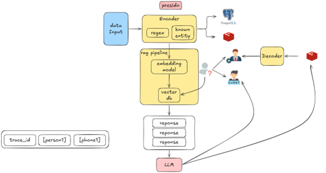
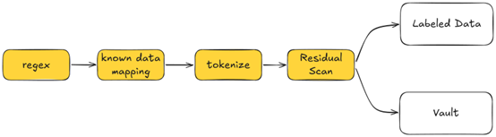
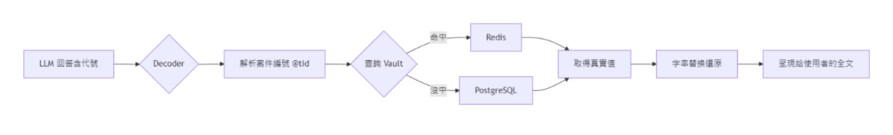

# PII-Mocking-RAG: 雙流隱私保護 RAG 系統 (Dual-Stream Privacy-Preserving RAG)
[](https://opensource.org/licenses/MIT)
[](https://www.python.org/downloads/)
[](https://www.docker.com/)
> **「零真實個資，精準語意檢索。」** 
> 本專題旨在設計並實作一套企業級的隱私保護 RAG 架構。透過在內部安全區部署去識別化中介層，確保向量資料庫與外部公有雲 LLM 在不接觸真實個資的情況下，仍能進行精準的語意檢索與上下文生成。

---

## 1. 專題背景

隨著大型語言模型（LLM）的普及，企業導入 AI 時面臨極高的資料外洩風險與法規合規挑戰（如 GDPR、個資法）。傳統的資料清洗往往會破壞文本上下文，導致 RAG 系統無法準確運作。

本系統透過「雙流隱私保護 RAG」架構，實現兼具高安全性與高可用性的企業級 AI 解決方案。

---

## 2. 系統架構

系統劃分為兩個核心安全邊界，確保資料在離開企業內部前已完成脫敏。

### 2.1 信任邊界與安全區劃分
1.  **內部安全區 (Internal Trusted Zone):** 包含前端介面 (CLI/ADMIN)、去識別化引擎 (Encoder/Masking)、暫存 (Redis/PostgreSQL) 以及還原引擎 (Decoder)。
2.  **外部不受信區 (External Untrusted Zone):** 包含向量資料庫 (Vector DB) 與大語言模型 (LLM)。此區域絕對禁止存在真實個資。

### 2.2 雙流檢索機制 (Dual-Stream Architecture)
*   **離線知識庫注入流 (Offline Ingestion Pipeline):** 針對內部規章與歷史檔案，預先進行遮蔽，將替換為安全代碼的「乾淨文本」向量化後存入 Vector DB。從源頭確保知識庫無個資殘留。
*   **即時問答檢索流 (Online Query Pipeline):** 使用者提問時，系統即時攔截並將提問中的個資轉換為對應標示，如 `[person1]`、`[phone1]` 等。由於提問與知識庫採用相同規則代碼化，系統能在外部 Vector DB 中進行精準的向量搜尋。


*圖 二：雙流隱私保護 RAG 系統架構圖*

---

## 3. 去識別化處理流程 (Encoder)

為確保資料隱私，系統實作了精準 PII 識別與匿名化工作管線：

1.  **Regex 掃描偵測個資:** 偵測常見格式個資（Email, 電話, 身分證）。
2.  **客戶資訊二次掃描:** 利用已知的客戶資訊資料庫進行比對。
3.  **Tokenization (標籤化):** 將資料轉換為對應標籤。
4.  **De-identification (去識別化):** 完成最終代碼替換。



*圖 一：Encoder 部分流程圖*

---

## 4. 代號定義邏輯

### 對話範圍限定的流水號 (Session-Scoped Sequential ID)
做法：例如 `[PERSON_1@Trace_ID]`, `[PHONE_1@Trace_ID]`。

*   **運作邏輯:** 當新 Request 進來時（帶著專屬 Trace_ID），系統從 1 開始為抓到的實體編號，並將 `Trace_ID@Tag` 作為 Key 存入 Redis/PostgreSQL。
*   **選擇此方法的理由:** 
    *   **極度節省 Token:** 簡潔的標籤格式減少消耗。
    *   **注意力集中:** LLM 對這類結構化標籤的 Attention 非常集中，幾乎不會發生拼字錯誤。
    *   **還原成功率高:** 透過綁定 Session ID，大幅提高查表還原的成功率。

---

## 5. 容錯防禦與還原機制 (Decoder)

在 LLM 生成回覆後，系統需將標籤化標記轉換回來，並根據使用者權限進行差異化處理。

*   **高權限 (如主管):** 執行完整搜索，將結果如實 Retrieve 出來並根據對應表進行還原回填。
*   **低權限 (如一般人員/客戶):** 僅提供結果摘要或遮蔽後的資訊，確保敏感數據最小化揭露。



*圖 三：Decoder Component 流程圖*

---

## 6. 快速開始

### 6.1 環境需求
*   Python 3.10+
*   Redis / PostgreSQL
*   Docker & Docker-compose

### 6.2 安裝步驟
```bash
# 複製專案
git clone https://github.com/imlacha/PII-Mocking-RAG.git

# 安裝依賴
pip install -r requirements.txt

# 啟動環境
docker-compose up -d
```

---

## 7. 未來展望
*   [ ] 支援更多 NLP 實體識別模型 (Named Entity Recognition, NER)。
*   [ ] 整合更複雜的權限審核機制。
*   [ ] 優化大規模向量庫的同步更新效率。
*   [ ] Encoder嘗試換成openai開源的PII Model
---

